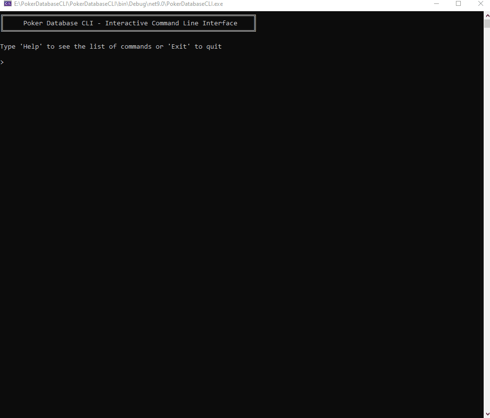

# PokerDatabaseCLI

Welcome to **PokerDatabaseCLI** – a command-line interface tool for managing and analyzing poker hand histories.

## Animation Preview

Here is a preview of the application in action:

## Sample Hands

You can download a sample folder of poker hands here:

[Cash.\_Holdem.\_NL25.\_2013.\_angrypaca.\_88k.\_107MB.zip](resources/Cash._Holdem._NL25._2013._angrypaca._88k._107MB.zip) – this is a folder containing poker hand histories for testing.
